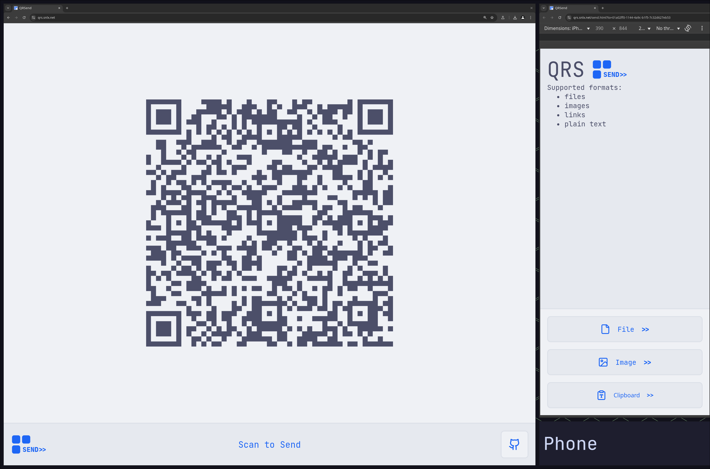

> Send any data via a QR code without having to log in / install anything

## Usage

- 🌐 Open [QRS](https://qrs.snlx.net) on the receiver device
- 📱 Scan the QR code with the sender device
- 📨 Click one of the buttons

## Supported File Types

- [x] 🖹 Text
- [x] 🔗 Links
- [ ] 📂 Files
- [ ] 🖼️ Images
- [ ] 🎤 Audio

## Contributing

- If you don't see any buttons on the sender, please submit an issue
- I'm using turn-rs on the server side because I found it the simplest to set up

## License

This project is under MIT
